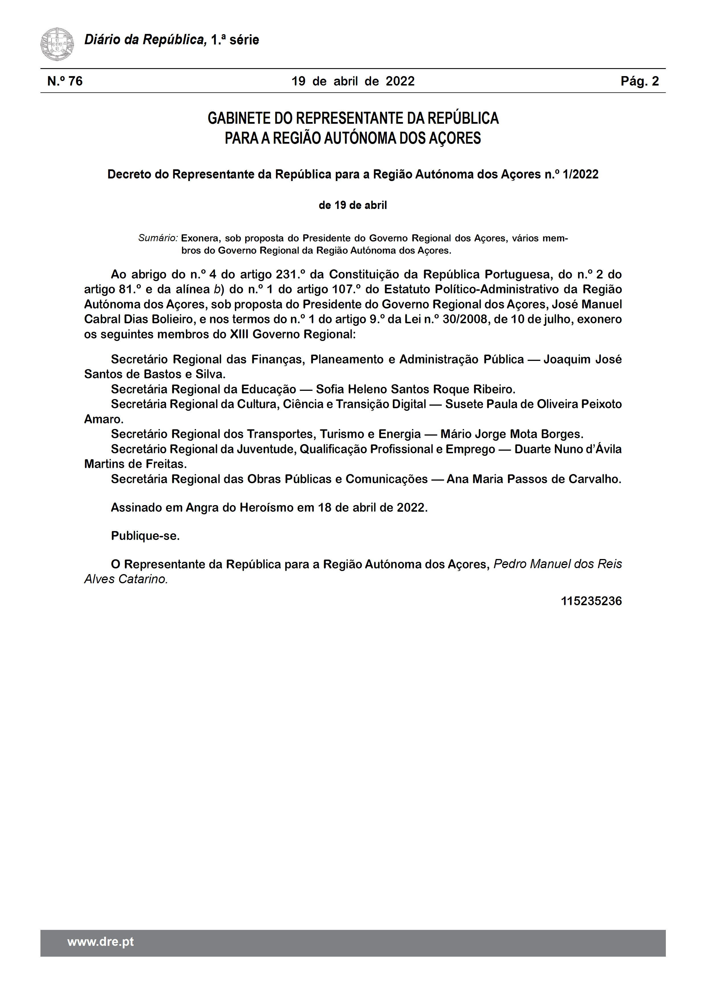
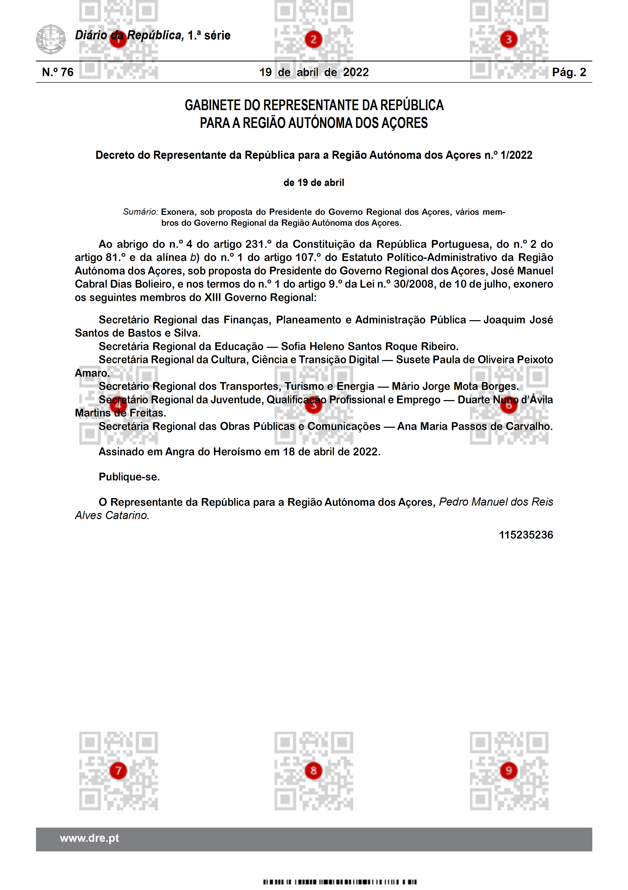
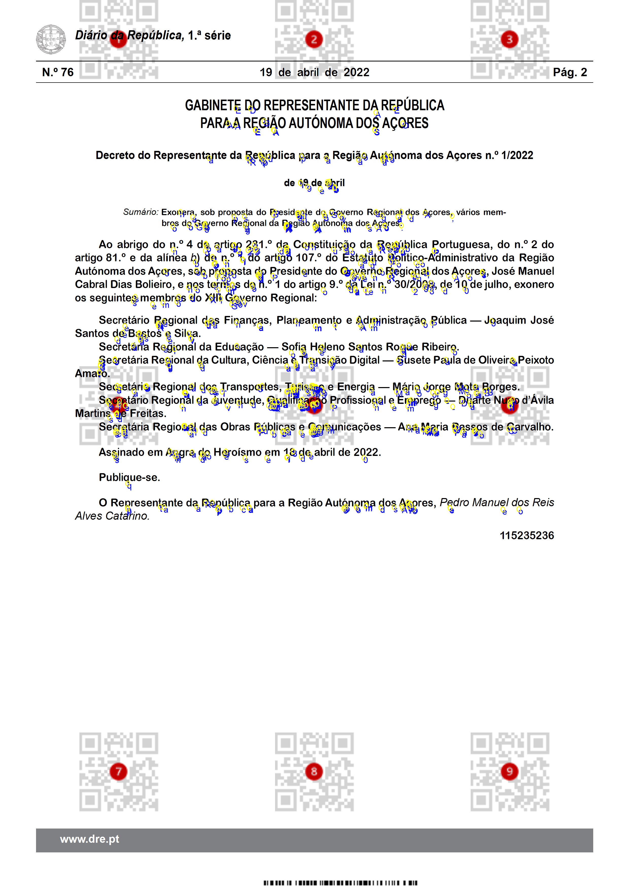

# Introduction
Regarding of  Master's thesis in Informatics Engineering at the University of Aveiro, it's intended that an applicational module be developed to be integrated with a qualified information management solution developed by the company iCreate Consulting.
This solution allows the possibility of printing classified documents, which must be activated to mark them in order to guarantee their security.

# Struct 

  <h4>Folders</h2>
  <ul style="list-style-type:circle">
    <li>9_qrcodes - main project</li>
    <li>Database - files to create user and database</li>
    <li>Qrcode Tests - testing the ideal number of qrcodes to use on project</li>
  </ul>
  <h4>Files</h2>
  <ul style="list-style-type:circle">
    <li>Tese.docx - documento tese </li>
  </ul>

 

# Packages
Packages needed to program run

 
  
BouncyCastle - Install-Package BouncyCastle -Version 1.8.9 

  
IronBarcode - Install-Package BarCode -Version 2022.8.8024 

  
iTextSharp - Install-Package iTextSharp -Version 5.5.13.3 

  
Freeware.Pdf2Png - Install-Package Freeware.Pdf2Png -Version 1.0.1 

 

 
 # Examples 
 Input file  
    
 Output file with watermark  
    
 Analise Forense   
    
 
