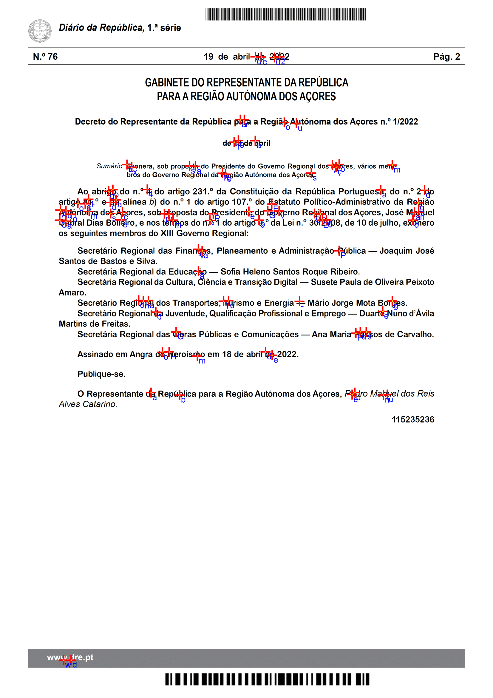

# Introduction
Regarding of  Master's thesis in Informatics Engineering at the University of Aveiro, it's intended that an applicational module be developed to be integrated with a qualified information management solution developed by the company iCreate Consulting.
This solution allows the possibility of printing classified documents, which must be activated to mark them in order to guarantee their security.

# Struct 

  <h4>Folders</h2>
  <ul style="list-style-type:circle">
    <li>ConsoleNet - project without gui, scan documents doesnt work here</li>
    <li>WatermarkApp - main project with gui</li>
    <li>Arquitetura - design of architecture of application, divided by process, retificate, and general</li>
    <li>database - files to create user and database</li>
    <li>positionCharacterJava - code to get the positions and character of a pdf file in java</li>  
  </ul>
  <h4>Files</h2>
  <ul style="list-style-type:circle">
    <li>Tese.docx - thesis doc</li>
    <li>Requirements - Requirements for using applications</li>
  </ul>

 

# Examples 
 Input file  
    
 Output file with watermark  
    
 Analise Forense   
    

 
